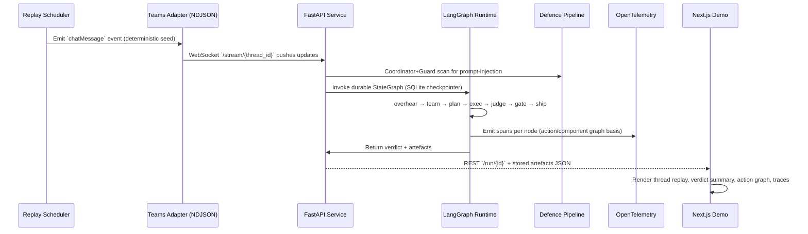

# OverhearOps — Architecture

## Sequence of a run


## State schema
```python
from typing import Any, Dict, List, TypedDict

class State(TypedDict, total=False):
    msg: Dict[str, Any]
    intents: List[str]
    team: List[Dict[str, Any]]
    plans: List[Dict[str, Any]]
    branches: List[Dict[str, Any]]
    artefacts: Dict[str, Any]
    verdict: Dict[str, Any]
    risk: Dict[str, Any]
```

## Components
- **apps/service:** FastAPI app exposing health, WebSocket stream, `POST /run/{thread}` trigger, and `GET /runs/{id}` retrieval. Persists artefacts under `runs/` and pipes spans to OTEL.
- **packages/agentkit:** LangGraph 1.0 StateGraph nodes (overhear intent detection, AgentInit-inspired team composer, planner, executor, judge, uncertainty gate).
- **packages/obs:** Observability helpers (OTEL bootstrap, action-graph stub, defence heuristics) citing LangSmith/Langfuse integrations.
- **apps/ui:** Next.js App Router UI mirroring Adaptive Cards ≤ v1.5. Streams Teams-like thread, triggers runs, and visualises verdict plus action graph JSON.
- **infra:** Docker Compose launching Jaeger and OTEL collector for local tracing.
- **data/demo:** Teams-shaped NDJSON threads for deterministic replay.

## Data flow
1. `apps/service/replay.py` replays NDJSON messages via WebSocket for demos and tests.
2. FastAPI service stores latest message, invokes LangGraph with SQLite checkpointer for resumability.
3. Nodes write spans through OTLP exporter; Jaeger displays traces. Action graph helper provides JSON fallback until span ingestion powers derived graphs.
4. Final artefacts (dry-run PR diff, Jira payload, rationale) saved per run under `runs/{run_id}` for governance review and replay.
5. Next.js UI fetches `/run/{id}` to display verdict, artefacts, and stored graph; thread view reuses WebSocket stream.

## Deployment notes
- Python 3.12 managed via `uv`; Node 20 for UI runtime.
- Environment variables documented in `.env.example` (OTEL endpoint, DB path, thresholds).
- SQLite checkpointer default path `overhearops.db`; override with `OVERHEAROPS_DB` or env for tests.
- Container-friendly: run `task dev` (starts collector via Docker Compose, backend via uvicorn, UI via npm).
- Future integrations: Microsoft Graph adapter, LangSmith/Langfuse OTEL exporters, governance modal with span IDs.
