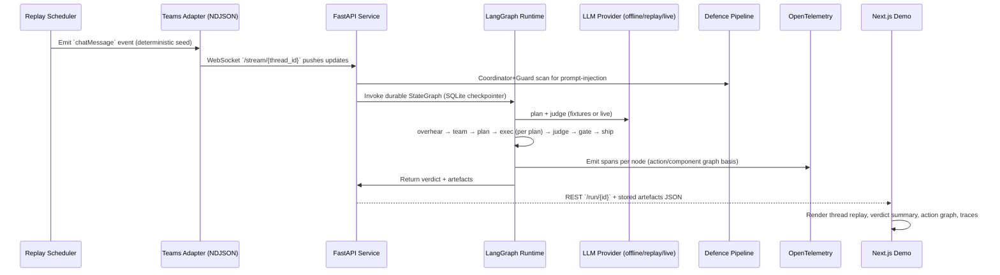

# OverhearOps — Architecture

## Sequence of a run

```mermaid
sequenceDiagram
    participant Replay as Replay Scheduler
    participant Teams as Teams Adapter (NDJSON)
    participant API as FastAPI Service
    participant Graph as LangGraph Runtime
    participant Provider as LLM Provider (offline/replay/live)
    participant Guard as Defence Pipeline
    participant OTEL as OpenTelemetry
    participant UI as Next.js Demo

    Replay->>Teams: Emit `chatMessage` event (deterministic seed)
    Teams->>API: WebSocket `/stream/{thread_id}` pushes updates
    API->>Guard: Coordinator+Guard scan for prompt-injection
    API->>Graph: Invoke durable StateGraph (SQLite checkpointer)
    Graph->>Provider: plan + judge (fixtures or live)
    Graph->>Graph: overhear → team → plan → exec (per plan) → judge → gate → ship
    Graph->>OTEL: Emit spans per node (action/component graph basis)
    Graph->>API: Return verdict + artefacts
    API-->>UI: REST `/run/{id}` + stored artefacts JSON
    UI->>UI: Render thread replay, verdict summary, action graph, traces
```

## State schema
```python
from typing import Any, Dict, List, TypedDict

class State(TypedDict, total=False):
    msg: Dict[str, Any]
    thread_id: str
    intents: List[str]
    team: List[Dict[str, Any]]
    plans: List[Dict[str, Any]]
    branches: List[Dict[str, Any]]
    artefacts_by_plan: Dict[str, Any]
    artefacts: Dict[str, Any]
    verdict: Dict[str, Any]
    gate: Dict[str, Any]
    risk: Dict[str, Any]
```

## Components
- **apps/service:** FastAPI app exposing health/probe endpoints, WebSocket stream, synchronous `POST /run/{thread}`, lifecycle `POST /runs` + `GET /runs/{id}/status` + `POST /runs/{id}/cancel`, replay controls (`GET /runs/dlq`, `POST /runs/{id}/replay`), approval/ship controls (`POST /runs/{id}/approve`, `GET /runs/{id}/approvals`, `POST /runs/{id}/ship`), simulation (`POST /runs/{id}/simulate`), history/search/export/compare endpoints, usage and analytics endpoints, admin settings/prompt/policy controls, DSR skeletons (`GET/POST /tenants/{tenant}/dsr/*`), and versioned API aliases under `/api/v1/*`. Persists status + artefacts under `runs/`, uses SQLite queue durability, supports API-key auth/RBAC/tenant scoping, and pipes spans to OTEL.
- **packages/agentkit:** LangGraph 1.0 StateGraph nodes (overhear intent detection, AgentInit-inspired team composer, planner, executor, judge, uncertainty gate).
- **packages/obs:** Observability helpers (OTEL bootstrap, dual exporter writing OTLP + local `spans.jsonl`, span-to-graph builder, defence heuristics) citing LangSmith/Langfuse integrations.
- **apps/ui:** Next.js App Router UI mirroring Adaptive Cards <=1.5. Streams the Teams-style thread, renders Cytoscape span graph, ribbons, and governance modal.
- **infra:** Docker Compose launching Jaeger and OTEL collector for local tracing.
- **data/demo:** Teams-shaped NDJSON threads for deterministic replay.

## Data flow
1. `apps/service/replay.py` replays NDJSON messages via WebSocket for demos and tests.
2. FastAPI service stores latest message, invokes LangGraph with SQLite checkpointer for resumability.
3. Nodes emit spans via OTLP exporter and the file exporter, writing `runs/{run_id}/spans.jsonl` for replay + action/component graphs.
4. The service derives `graphs.json`, stores `artefacts.json` (including `artefacts_by_plan`), and persists `hash.txt` (SHA-256 of span timeline) alongside the raw spans.
5. Next.js UI fetches `/run/{id}` and `/runs/{id}/graphs.json`, displays verdict, ribbons, Cytoscape action graph, and the governance modal with replay hash + reproduce command.

## Span model
- `spanify(name)` decorates each LangGraph node, capturing `agent.role`, `overhearops.thread_id`, inferred branch identifiers, and approximate token flow in/out.
- Parent span context is preserved so the action graph mirrors the runtime order and respects the branch-width cap from `OVERHEAROPS_BRANCH_WIDTH`.
- `OVERHEAROPS_RUN_ID` pins the SQLite checkpointer thread and ensures spans land in `runs/{id}/spans.jsonl` for replay and downstream graphs.
- Replay hashes run over ordered `(span_id, name, start, end)` tuples, guaranteeing deterministic verification alongside persisted artefacts.

## Deployment notes
- Python 3.12 managed via `uv`; Node 20 for UI runtime.
- Environment variables documented in `.env.example` (OTEL endpoint, DB path, thresholds, provider + Graph settings).
- SQLite checkpointer default path `overhearops.db`; override with `OVERHEAROPS_DB` or env for tests.
- Container-friendly: run `task dev` (starts collector via Docker Compose, backend via uvicorn, UI via npm).
- Integrations: Microsoft Graph adapter (credential scopes + shared retry/circuit policy), LangSmith/Langfuse OTEL exporters, governance modal with span IDs.
- Persisted run/status/approval JSON now flows through a codec abstraction (`apps/service/storage_codec.py`) with key-rotation metadata hooks.
- Runtime policy/config surfaces are externalized to `config/runtime_settings.json`, `config/prompt_registry.json`, and `config/policy_rules.json`.

## Adapter seam
```mermaid
flowchart LR
    UI[Next.js UI] -->|REST/WebSocket| API
    Playground[Agents Playground] -->|Adaptive Card| API
    API -- ADAPTER=demo --> Demo[NDJSON demo adapter]
    API -- ADAPTER=graph --> Graph[Teams Graph adapter]
    API -- ADAPTER=playground --> Exporter[Plan card exporter]
    Demo --> Threads[data/demo/threads]
    Graph --> "Microsoft Graph API"
```
Runtime selection happens via the `ADAPTER` environment variable. `graph` mode uses OAuth2 client credentials and supports `team_id:channel_id` or `chat:chat_id` targets; demo and playground remain credential-free.

## Governance & replay
- Each run sets `OVERHEAROPS_RUN_ID`, enabling the file exporter to append spans and the service to calculate a replay hash.
- The governance modal surfaces trace IDs, branch counts, and the reproduce command (`uv run apps/service/replay.py --thread ci_flake --seed 42`).
- Determinism is enforced by hashing `(span_id, name, start_ts, end_ts)` and storing the value in `runs/{id}/hash.txt`.
- The uncertainty gate implements an abstain policy: low-confidence verdicts prevent artefact shipment and surface a blocked banner in the UI.
- Run lifecycle now includes `cancel_requested`, `cancelled`, and `timed_out` status paths with audit-log records, plus queue-backed DLQ replay and approval-gated live shipping.
